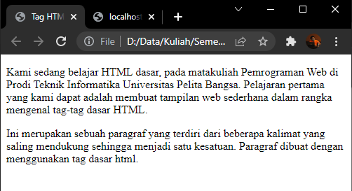

# Lab1Web
Tugas Praktikum Pertemuan 2

Nama    : Faza Ardan Kusuma <br>
NIM     : 312010001<br>
Kelas   : TI 20 B1

Pertama kita buat tag HTML terlebih dahulu dengan nama <b>lab1_tag_dasar.html</b> dan tambahkan tag dasar dokumen HTML.<br>

```<!DOCTYPE html>
<head>
    <title>Tag HTML Dasar</title>
</head>
<body>
    
</body>
</html>
```


Maka tampilannya akan menjadi seperti berikut pada browser.<br>


<br>

## 1. Membuat Paragraf <br>

Pada poin ini saya akan membuat paragraf pada file HTML.<br>
Pada sintax p bertujuan untuk membuat paragraf baru. Berikut source codenya : <br>
```
<!-- Ini adalah paragraf pertama -->
<p>Kami sedang belajar HTML dasar, pada matakuliah Pemrograman Web di Prodi Teknik Informatika Universitas Pelita Bangsa. Pelajaran pertama yang kami dapat adalah membuat tampilan web sederhana dalam rangka mengenal tag-tag dasar HTML.</p>
<!-- Ini adalah paragraf kedua -->
<p>Ini merupakan sebuah paragraf yang terdiri dari beberapa kalimat yang saling mendukung sehingga menjadi satu kesatuan. Paragraf dibuat dengan menggunakan tag dasar html. </p>
```

Berikut adalah tampilannya : <br>
<br>

<b>Merubah Paragraf</b><br>
Untuk membuat paragraf menjadi ditengah dan misalnya rata kanan, maka source code dirubah menjadi seperti berikut : <br>
``` <!-- Ini adalah paragraf pertama -->
<p align=”center”>Kami sedang belajar HTML dasar, pada matakuliah Pemrograman Web di Prodi Teknik Informatika Universitas Pelita Bangsa. Pelajaran pertama yang kami dapat adalah membuat tampilan web sederhana dalam rangka mengenal tag-tag dasar HTML.</p>
<!-- Ini adalah paragraf kedua -->
<p align=”right”>Ini merupakan sebuah paragraf yang terdiri dari beberapa kalimat yang saling mendukung sehingga menjadi satu kesatuan. Paragraf dibuat dengan menggunakan tag dasar html.</p>
```

Berikut tampilannya :<br>
