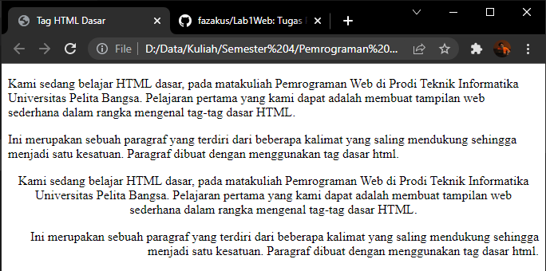
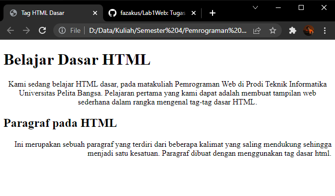
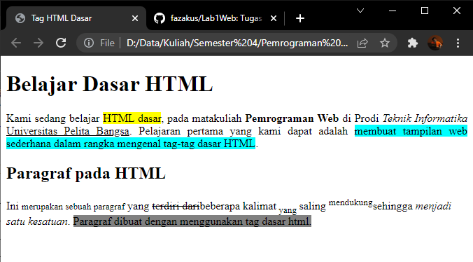

# Lab1Web
Tugas Praktikum Pertemuan 2

Nama    : Faza Ardan Kusuma <br>
NIM     : 312010001<br>
Kelas   : TI 20 B1

Pertama kita buat tag HTML terlebih dahulu dengan nama <b>lab1_tag_dasar.html</b> dan tambahkan tag dasar dokumen HTML.<br>

```<!DOCTYPE html>
<head>
    <title>Tag HTML Dasar</title>
</head>
<body>
    
</body>
</html>
```


Maka tampilannya akan menjadi seperti berikut pada browser.<br>


<br>

## 1. Membuat Paragraf <br>

Pada poin ini saya akan membuat paragraf pada file HTML.<br>
Pada sintax p bertujuan untuk membuat paragraf baru. Berikut source codenya : <br>
```
<!-- Ini adalah paragraf pertama -->
<p>Kami sedang belajar HTML dasar, pada matakuliah Pemrograman Web di Prodi Teknik Informatika Universitas Pelita Bangsa. Pelajaran pertama yang kami dapat adalah membuat tampilan web sederhana dalam rangka mengenal tag-tag dasar HTML.</p>
<!-- Ini adalah paragraf kedua -->
<p>Ini merupakan sebuah paragraf yang terdiri dari beberapa kalimat yang saling mendukung sehingga menjadi satu kesatuan. Paragraf dibuat dengan menggunakan tag dasar html. </p>
```

Berikut adalah tampilannya : <br>
<br>

<b>Merubah Paragraf</b><br>
Untuk membuat paragraf menjadi ditengah dan misalnya rata kanan, maka source code dirubah menjadi seperti berikut : <br>
``` <!-- Ini adalah paragraf pertama -->
<p align="center">Kami sedang belajar HTML dasar, pada matakuliah Pemrograman Web di Prodi Teknik Informatika Universitas Pelita Bangsa. Pelajaran pertama yang kami dapat adalah membuat tampilan web sederhana dalam rangka mengenal tag-tag dasar HTML.</p>
<!-- Ini adalah paragraf kedua -->
<p align=”right”>Ini merupakan sebuah paragraf yang terdiri dari beberapa kalimat yang saling mendukung sehingga menjadi satu kesatuan. Paragraf dibuat dengan menggunakan tag dasar html.</p>
```

Berikut tampilannya :<br>
<br>
Dalam tampilan tersebut terlihat perbedaan antara yang belum dirubah paragrafnya dan yang sudah.<br>

## 2. Menambahkan Judul (Heading) <br>

Judul memiliki 6 level, yaitu <i>h1 sampai dengan h6</i>. <br>
Disini saya akan menambahkan judul h1 pada oaragraf pertama dan judul h2 pada paragraf kedua.<br>
Maka dari itu, source code saya rubah menjadi : <br>
```
<!-- judul paragraf pertama -->
<h1>Belajar Dasar HTML</h1>
<!-- Ini adalah paragraf pertama -->
<p align="center">Kami sedang belajar HTML dasar, pada matakuliah Pemrograman Web di Prodi Teknik Informatika Universitas Pelita Bangsa. Pelajaran pertama yang kami dapat adalah membuat tampilan web sederhana dalam rangka mengenal tag-tag dasar HTML.</p>

<!-- judul paragraf kedua -->
<h2>Paragraf pada HTML</h2>
<!-- Ini adalah paragraf kedua -->
<p align="right">Ini merupakan sebuah paragraf yang terdiri dari beberapa kalimat yang saling mendukung sehingga menjadi satu kesatuan. Paragraf dibuat dengan menggunakan tag dasar html. </p>
```

Berikut untuk tampilannya : <br>
<br>

## 3. Memformat Text

Setelah selesai memberi Judul, disini saya akan mencoba untuk merubah format text seperti membuat text with background, bold text, italic text, underlined text, smaller text, subscript text dan superscript.<br>

Disini selain saya rubah format text, saya juga rubah alignment pada kedua paragraf, yaitu rata kanan-kiri pada paragraf pertama dan rata kiri pada paragraf kedua, berikut adalah source codenya: <br>

```
<!-- judul paragraf pertama -->
<h1>Belajar Dasar HTML</h1>
<!-- Ini adalah paragraf pertama -->
<p align="justify">Kami sedang belajar <mark style="background-color:yellow">HTML dasar</mark>, pada matakuliah <b>Pemrograman Web</b> di Prodi <i>Teknik Informatika</i> <u>Universitas Pelita Bangsa</u>. Pelajaran pertama yang kami dapat adalah <mark style="background-color:aqua">membuat tampilan web sederhana dalam rangka mengenal tag-tag dasar HTML</mark>.</p>

<!-- judul paragraf kedua -->
<h2>Paragraf pada HTML</h2>
<!-- Ini adalah paragraf kedua -->
<p >Ini <small>merupakan sebuah paragraf</small> yang <del>terdiri dari</del>beberapa kalimat<sub> yang </sub>saling <sup>mendukung</sup>sehingga <i>menjadi satu kesatuan</i>. <mark style="background-color: grey">Paragraf dibuat dengan menggunakan tag dasar html.</mark> </p>
```

Maka, tampilannya akan berubah menjadi seperti berikut : <br>
<br>


